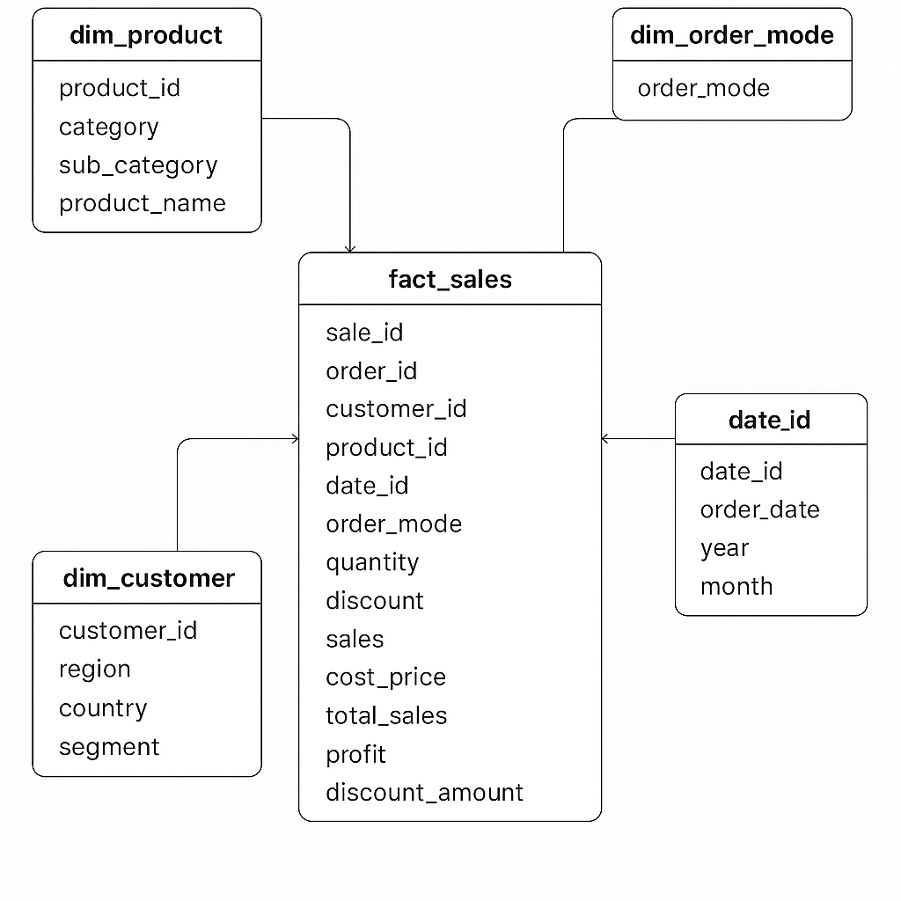
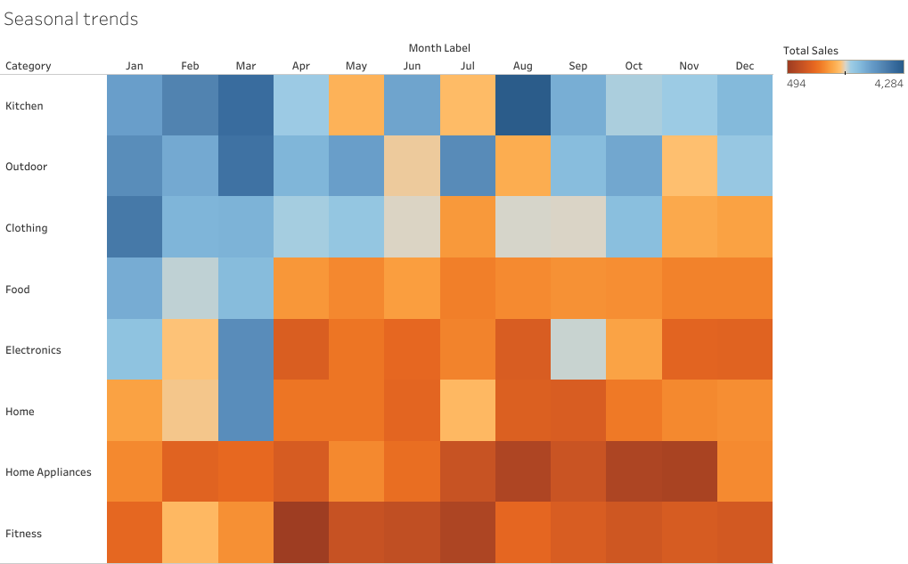
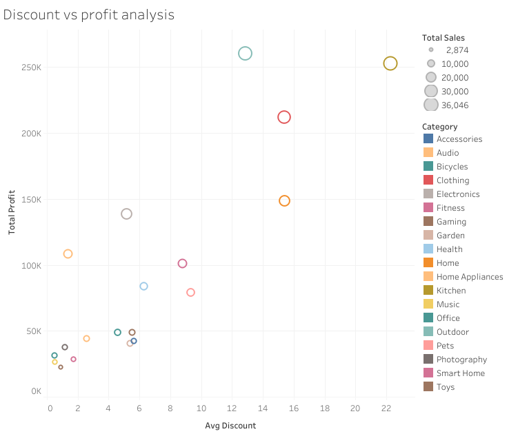
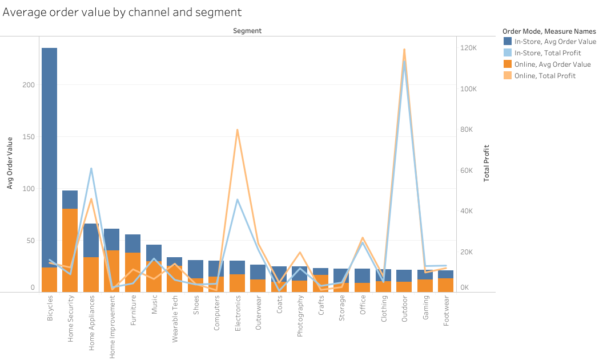
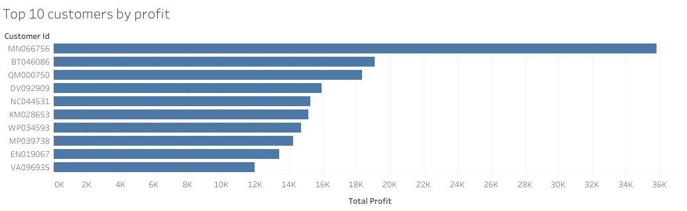
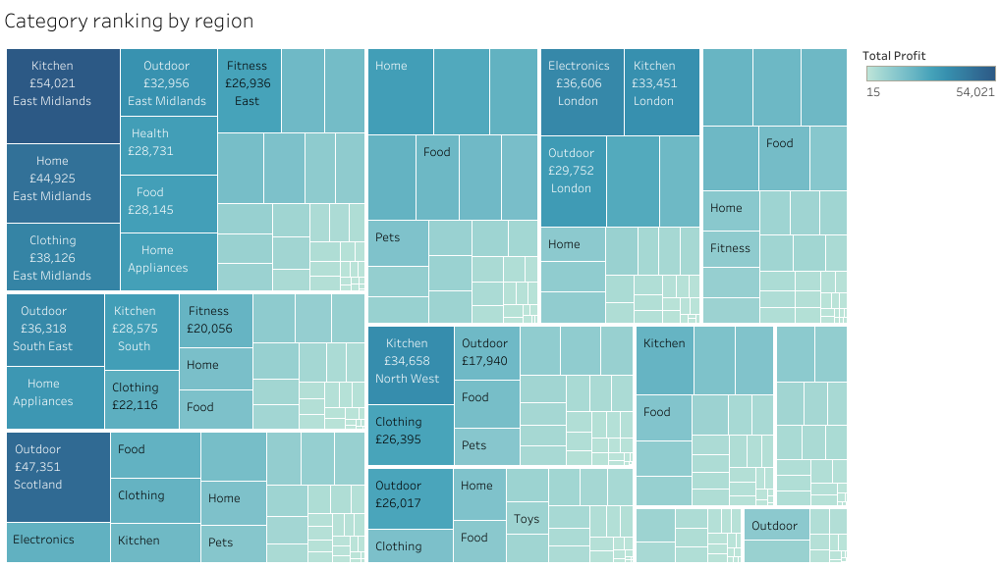

# RDAMP-Dimensional-Model-Tableau
# ACE Superstore Data Analytics Project

## Project Overview

### Task Objective

Following the foundational analysis completed in Task 1, Ace Superstore aims to transition its cleaned dataset into a query-optimized reporting system. This task includes two primary responsibilities:

1. Design and implement a star schema using SQL.
2. Create SQL views from the schema and connect them to a business intelligence tool to produce advanced interactive dashboards.

Dimensional modeling best practices were applied to simulate a real-world analytics workflow. The schema and reporting layer are structured to support usability, scalability, and strategic insight across multiple business domains.

### Business Impact

This solution transforms fragmented sales data into a centralized reporting model optimized for enterprise use. By structuring the data for analysis and enabling visual reporting, it empowers business users to evaluate performance across time periods, channels, products, and regions.

---

## Dimensional Schema Overview

The star schema consists of a single fact table—`fact_sales`—at the center, surrounded by five dimension tables:

- `dim_product`
- `dim_customer`
- `dim_order_mode`
- `dim_date`
- (Staging tables are used for preprocessing prior to insertion.)

The schema was designed using SQL in PostgreSQL and supports multi-angle analysis such as product trends, regional performance, customer behavior, and channel profitability.

---

## Table Descriptions

### Fact Table

- **fact_sales**: Contains transactional metrics and foreign keys that link each sale to dimensions of time, product, customer, and channel.

### Dimension Tables

- **dim_product**: Includes product category, sub-category, and name.
- **dim_customer**: Captures customer location attributes and business segment classification.
- **dim_order_mode**: Describes the sales channel (e.g., Online or In-Store).
- **dim_date**: Provides derived temporal values including month, quarter, and year from the order date.

---

## SQL Setup Instructions

1. Install PostgreSQL and open a SQL environment.
2. Run the `Elena_Losavio_create_and_populate_dimensions_and_fact_sales.sql` script to create dimension and fact tables.
3. Use `\copy` statements to import data from cleaned CSV files:
   - `dim_product.csv`
   - `dim_customer.csv`
   - `dim_order_mode.csv`
   - `dim_date.csv` (via staging table)
   - `fact_sales.csv` (via staging table)
4. Execute surrogate key logic for `dim_date`.
5. Insert clean and validated data into `fact_sales` using joins with `dim_date` and referential integrity checks.

---

## Business Intelligence Connection

### Tableau Public (MacOS Workflow)

Due to macOS compatibility constraints, Power BI could not be used in this project. Additionally, the lack of access to Tableau Desktop on the current system required the use of **Tableau Public** as the primary visualization tool.

Key workflow adjustments:

- CSV outputs from PostgreSQL were manually downloaded and uploaded to Tableau Public.
- Dashboards were built from static data instead of live connections.
- Published dashboards are interactive and hosted on Tableau Public for accessible analysis.

---

## Dashboard Visuals Overview

This dashboard presents five key insights derived from ACE Superstore's sales data. Each visual is linked to its corresponding screenshot for reference.

### 1 Product Seasonality Trends  
**Chart Type:** Heatmap  
**Insight:** Reveals monthly purchasing patterns by category.  

Kitchenware sales are high and stable, with peaks in March (possibly linked to the start of spring) and August (potentially due to barbecues). Outdoor goods and clothing are also top performers. Summer sales overall appear less stable and less frequent.

---

### 2 Discount vs. Profit Analysis  
**Chart Type:** Scatter plot chart
**Insight:** Evaluates the relationship between discounting and profitability.  

Discounted items within the 12% to 22% range perform best. Kitchenware, outdoor goods and clothing are strong across seasons and most profitable when discounted within this range. Toys and music are rarely discounted and generate low profit, suggesting a review of the discount strategy.

---

### 3 Average Order Value by Channel and Segment  
**Chart Type:** Combo chart  
**Insight:** Compares order values across market segments and channels.  

---

### 4 Top 10 Customers by Profit Contribution  
**Chart Type:** Horizontal bar chart  
**Insight:** Highlights your most profitable customers.  

The most profitable customer generate £36K, twice the amount of the second most profitable. Further investigation is recommended to determine if these are bulk orders or a corporate partner, and to explore extending similar agreements to other large customers.

---

### 5 Category Ranking by Region  
**Chart Type:** Treemap  
**Insight:** Ranks product category performance across regions.  

Product performance varies between regions. In Scotland, investing in the outdoor range could attract holidaymakers interested in hiking and related activities. In the East Midlands, there is stronger demand for home and kitchen products, which could guide targeted expansion.

## Key Recommendations

- Maintain focus on kitchenware, outdoor goods and clothing, with seasonal campaigns in spring and late summer.
- Apply between 12% and 22% discounts strategically to maximise profit in high-performing categories.
- Investigate top customers to identify bulk or corporate opportunities, then expand similar partnerships.
- Tailor product ranges to regional preferences, investing in outdoor goods for Scotland and home/kitchen products for the East Midlands.
